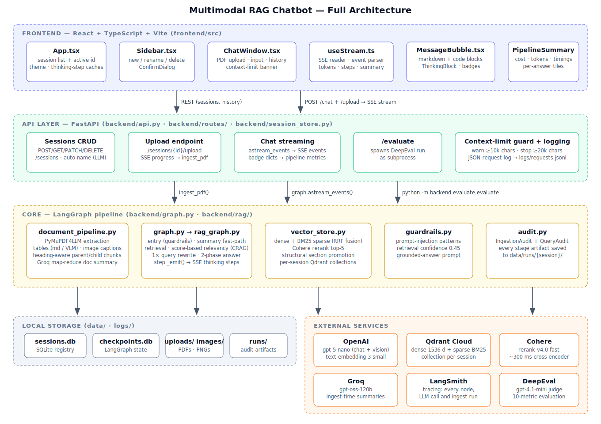
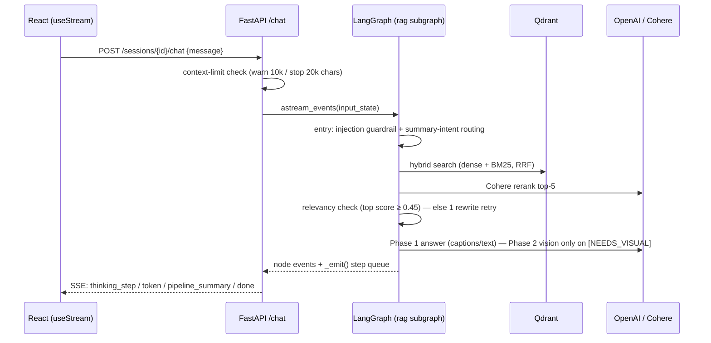
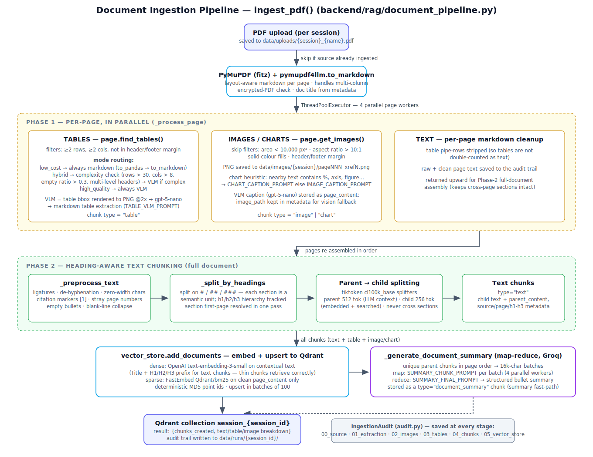
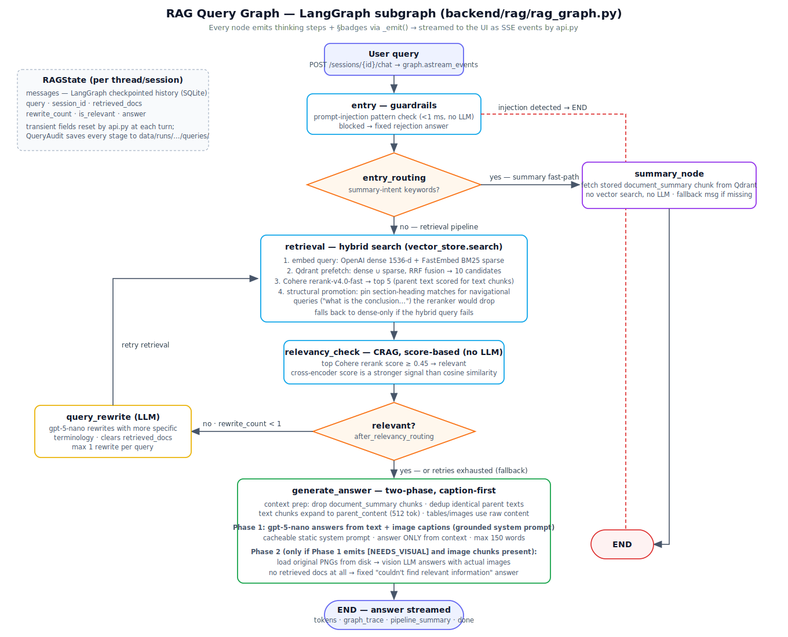
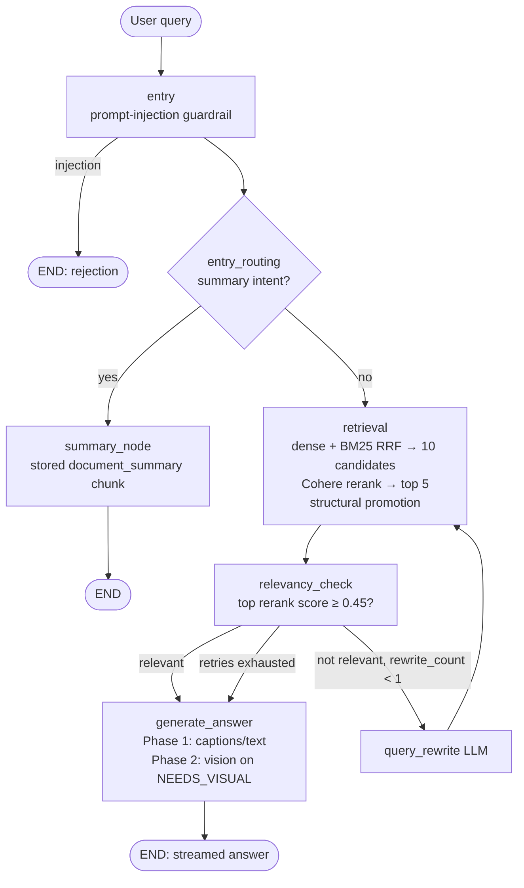
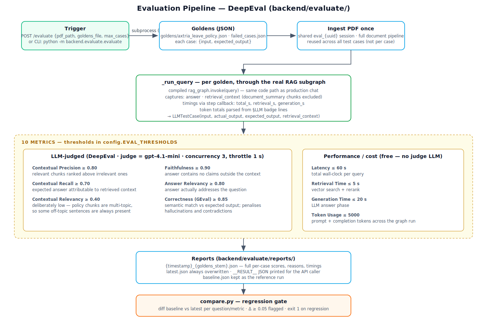

# Multimodal RAG Chatbot — Architecture Documentation

> Generated from the codebase as of 2026-07-11.
> Diagrams: [`docs/images/`](images/) — `architecture.svg`, `document-pipeline.svg`, `rag-graph.svg`, `evaluation.svg` (open in any browser). Mermaid sources are embedded below and render on GitHub / VS Code.

---

## 1. Full Architecture



**Single mode: Multimodal RAG.** The app answers questions over one uploaded PDF per session — text, tables, images and charts. Every query goes through the RAG subgraph; there is no general-chat bypass.

### Layers

| Layer | Location | Responsibility |
|---|---|---|
| Frontend | `frontend/src/` | React + TypeScript (Vite). Sessions sidebar, chat window, SSE stream consumption, thinking-step & pipeline-summary rendering. |
| API | `backend/api.py` + `backend/routes/` | FastAPI. `api.py` assembles the app; routers: `sessions.py` (CRUD + auto-name + history + cascading delete, backed by `backend/session_store.py`), `upload.py` (SSE ingestion progress), `chat.py` (SSE chat streaming, context-limit guard, pipeline metrics, JSON request logging), `evaluation.py` (DeepEval trigger). |
| Core | `backend/graph.py`, `backend/rag/` | LangGraph master graph → RAG subgraph, ingestion pipeline, hybrid vector search, guardrails, audit trail. |
| Storage | `data/`, `logs/` | `sessions.db` (registry), `checkpoints.db` (LangGraph conversation state), `uploads/` (PDFs), `images/` (extracted PNGs), `runs/` (audit artifacts), `requests.jsonl` (rotating request log). |
| External | — | OpenAI (`gpt-5-nano` chat + vision, `text-embedding-3-small`), Qdrant Cloud (vectors), Cohere (`rerank-v4.0-fast`), Groq (`gpt-oss-120b` ingest-time summaries), LangSmith (tracing), DeepEval (`gpt-4.1-mini` judge). |

### Key architectural decisions

- **`backend/config.py` is the single source of truth** — all model names, prices, chunk sizes, thresholds and paths live there.
- **One Qdrant collection per session** (`session_{session_id}`), so deleting a session cleanly drops its vectors.
- **Conversation state** is checkpointed by LangGraph (`AsyncSqliteSaver`, thread_id = session_id); the sessions table only stores id/name/document.
- **Observability at three levels**: LangSmith traces (every node is `@traceable`), the SSE thinking-step stream with structured badge objects (LLM tokens/cost, Qdrant timings, Cohere rerank), and a per-stage on-disk audit trail (`backend/rag/audit.py`).
- **Session deletion is a 6-step cascade** (`routes/sessions.py:delete_session`): registry row → Qdrant collection → LangGraph checkpoints → uploaded PDF → extracted PNGs → in-memory upload status.

### Request flow (chat)



---

## 2. Document Ingestion Pipeline



Entry point: `ingest_pdf(file_path, session_id, mode)` in `backend/rag/document_pipeline.py`, called from the upload endpoint via `asyncio.to_thread`. Re-ingesting the same source into a session is a no-op (checked against Qdrant payloads).

### Phase 1 — per-page, in parallel (4 workers)

Each page is processed by `_process_page` in a thread pool:

- **Tables** (`page.find_tables()`), filtered to ≥2 rows / ≥2 cols and outside the 8% header/footer margin. Processing mode (`PIPELINE_MODE`, default `hybrid`):
  - `low_cost` — always pandas → markdown.
  - `hybrid` — rule-based routing: a table goes to the VLM if rows > 30, cols > 8, empty-cell ratio > 0.3 (merged-cell artifact) or multi-level headers are detected; otherwise markdown.
  - `high_quality` — always VLM. VLM path renders the table bbox to PNG at 2× and asks `gpt-5-nano` to extract a markdown table.
- **Images/charts** (`page.get_images()`), with skip filters: area < 10,000 px², extreme aspect ratio (> 10:1 — rules/dividers), solid-colour fills, header/footer margin. Kept images are saved to `data/images/{session}/pageNNN_xrefN.png`; a chart heuristic (nearby text with `%`, `axis`, `figure`…) picks between the chart and image caption prompts. The **VLM caption becomes `page_content`** (what is embedded and searched); the PNG path stays in metadata for the vision fallback at answer time.
- **Text** — table pipe-rows are stripped from the page markdown so tables aren't double-counted, and the cleaned per-page text is returned for Phase 2.

### Phase 2 — heading-aware text chunking (whole document)

1. Pages are re-assembled **in order** into one full-document string (preserves sections spanning page breaks).
2. `_preprocess_text`: ligatures, de-hyphenation, zero-width chars, `[n]` citation markers, stray page numbers, empty bullets, blank-line collapsing.
3. `_split_by_headings`: split on `#`/`##`/`###`; each section is a semantic unit and carries its `h1/h2/h3` hierarchy. Section → first page resolved in a single pass over the lines.
4. **Parent/child splitting** (tiktoken `cl100k_base`, same family as the embedder): parents 512 tokens (sent to the LLM), children 256 tokens (embedded + searched). **Chunks never cross section boundaries.** Each child stores its `parent_content` in metadata.

### Embedding & upsert (`vector_store.add_documents`)

- **Dense**: OpenAI `text-embedding-3-small` on *contextualised* text — text chunks get a `Title / H1 / H2 / H3` prefix so semantically thin chunks (bullet lists) retrieve correctly. Tables/images embed as-is.
- **Sparse**: FastEmbed `Qdrant/bm25` on the clean `page_content` only (no prefix noise in the keyword index).
- Deterministic MD5 point IDs; upsert in batches of 100; payload keyword index on `metadata.type`.

### Document summary (map-reduce, Groq)

`_generate_document_summary` collects unique parent chunks in page order, batches them into ~16k-char windows, summarises each batch in parallel via Groq `gpt-oss-120b`, then reduces to one structured bullet summary. Stored as a `type="document_summary"` chunk — used **only** by the summary fast-path at query time (excluded from normal answer context). All failures are logged and never break ingestion.

### Audit trail

`IngestionAudit` writes every stage artifact to `data/runs/{session_id}/`: source PDF, raw/clean page text, kept/skipped images with reasons, table PNG + markdown/VLM output, parent/child chunks per section, upsert summary, ingestion summary.

---

## 3. RAG Query Graph



`backend/graph.py` compiles a master graph with a single node — the RAG subgraph from `backend/rag/rag_graph.py` — so LangSmith sees one trace tree. State (`RAGState`) extends `MessagesState` with `session_id`, `query`, `retrieved_docs`, `rewrite_count`, `is_relevant`, `answer`; transient fields are reset by `api.py` at each turn.



### Node details

- **entry** — pattern-based prompt-injection guardrail (`guardrails.py`, <1 ms, no LLM). Blocked queries get a fixed rejection and skip everything.
- **entry_routing** — keyword-based summary-intent detection (`summarise`, `overview`, `what is this document`…) routes to the summary fast-path: no vector search, no LLM.
- **retrieval** — calls `vector_store.search`: embed query (dense + sparse), Qdrant RRF-fused prefetch of 10 candidates, Cohere rerank to top 5. The reranker scores **parent text** for text chunks so it sees full context. *Structural promotion* then pins chunks whose section headings match navigational queries ("what is the conclusion") that the semantic reranker reliably drops. Hybrid failure falls back to dense-only.
- **relevancy_check (CRAG)** — no LLM call: the top Cohere score (cross-encoder, jointly evaluates query–chunk fit) is compared to `RELEVANCY_SCORE_THRESHOLD = 0.45`.
- **query_rewrite** — one LLM rewrite max (`MAX_REWRITE_COUNT = 1`); clears `retrieved_docs` and retries retrieval.
- **generate_answer** — two-phase, caption-first:
  - Context prep: drop `document_summary` chunks, dedup identical parent expansions, join with `---` separators.
  - **Phase 1**: `gpt-5-nano` with the static, cacheable grounded system prompt (`CAPTION_ANSWER_SYSTEM`) — answer only from context, bold key figures, ≤150 words, fixed refusal phrase when the context has nothing.
  - **Phase 2**: only when Phase 1 outputs `[NEEDS_VISUAL]` **and** image/chart chunks are present — the original PNGs are loaded from disk and sent to the vision LLM. This avoids paying a vision call when the caption already suffices.

### Streaming observability

Every node calls `_emit(session_id, step)`; `routes/chat.py` registers a per-request callback (keyed by session id, so concurrent sessions never see each other's steps), drains the queue between LangGraph events, and forwards each step as a `thinking_step` SSE event. A step is either a plain string (detail line) or a structured badge dict — `{"badge": "llm"|"qdrant"|"cohere", ...metric fields}` — which `PipelineMetrics` aggregates into the end-of-turn `pipeline_summary` event (LLM calls, tokens, cached tokens, cost, Qdrant/rerank/embed timings) and the UI renders as chips. A `QueryAudit` mirrors every stage (query, vectors, prefetch, rerank, context, answers) to `data/runs/{session}/queries/`.

---

## 4. Evaluation Pipeline



Entry points: `POST /evaluate` (spawns `python -m backend.evaluate.evaluate` as a **subprocess** — DeepEval manages its own event loop and SIGINT handler, which conflicts with uvicorn's loop if run in-process) or the CLI directly.

### Flow

1. **Goldens** (`backend/evaluate/goldens/*.json`): list of `{input, expected_output}` pairs. `max_cases` limits the run for smoke tests.
2. **Ingest once** — the PDF goes through the full production ingestion pipeline into a shared `eval_{uuid}` session, reused for every case.
3. **Per-case run** (`_run_query`) — each golden runs through the *real compiled RAG subgraph* (same code path as production chat). Captured per case: answer, retrieval context (with `document_summary` chunks excluded so they don't poison the contextual metrics), retrieval/generation/total timings (via the step callback) and token totals (parsed from `§LLM` badges).
4. **Metrics** — 10 total, thresholds in `config.EVAL_THRESHOLDS`:

| Metric | Threshold | Judge | Measures |
|---|---|---|---|
| Contextual Precision | ≥ 0.80 | gpt-4.1-mini | relevant chunks ranked above irrelevant |
| Contextual Recall | ≥ 0.70 | gpt-4.1-mini | expected answer attributable to retrieved context |
| Contextual Relevancy | ≥ 0.40 | gpt-4.1-mini | intentionally low: policy chunks are multi-topic |
| Faithfulness | ≥ 0.90 | gpt-4.1-mini | no claims outside the context |
| Answer Relevancy | ≥ 0.80 | gpt-4.1-mini | answer addresses the question |
| Correctness (GEval) | ≥ 0.85 | gpt-4.1-mini | semantic match vs expected output |
| Latency | ≤ 60 s | — | total wall-clock |
| Retrieval Time | ≤ 5 s | — | search + rerank |
| Generation Time | ≤ 20 s | — | LLM answer phase |
| Token Usage | ≤ 5000 | — | prompt + completion tokens per case |

   LLM-judged metrics run through DeepEval with concurrency 3 and a 1 s throttle.

5. **Reports** — `backend/evaluate/reports/{timestamp}_{goldens}.json` plus `latest.json` (always overwritten); `baseline.json` is the kept reference. The subprocess prints `__RESULT__<json>` on stdout for the API caller.
6. **Regression gate** — `python -m backend.evaluate.compare baseline.json latest.json` diffs every question/metric pair; a score drop ≥ 0.05 is flagged and the exit code becomes 1 (CI-friendly).

---

## 5. SSE Event Protocol (backend → frontend)

| Event | Payload | Purpose |
|---|---|---|
| `thinking_step` | `step` or `badge`, `node`, optional `parent_node` | top-level node label, or a detail line / badge grouped under it |
| `thinking_step_output` | `node`, `output:"done"` | marks a node complete |
| `thinking_done` | `duration_ms` | collapses the thinking block |
| `token` | `content` | streamed answer token |
| `pipeline_summary` | tokens, cost, timings, chunk counts | per-answer metrics tiles |
| `context_limit` | `message`, `warn_only` | warn at 10k chars of history, hard-stop at 20k |
| `done` / `error` | `answer` / `message` | terminal events |
| upload: `progress` / `complete` / `error` | `message`, `progress`, `breakdown` | ingestion progress |

Detail events carrying a `badge` object (`{"badge": "llm"|"qdrant"|"cohere", ...}`) are rendered as coloured metric chips in `ThinkingBlock.tsx`; plain `step` strings are rendered as text lines.

---

## 6. How to Run

```powershell
# Backend — MUST run from the project root (absolute `backend.*` imports)
cd "C:\...\RAG\project"
uvicorn backend.api:app --reload

# Frontend
cd frontend
npm run dev          # Vite proxies /api → FastAPI

# Evaluation
python -m backend.evaluate.evaluate "your_pdf.pdf" backend/evaluate/goldens/goldens_from_your_pdf.json
python -m backend.evaluate.compare backend/evaluate/reports/baseline.json backend/evaluate/reports/latest.json
```
